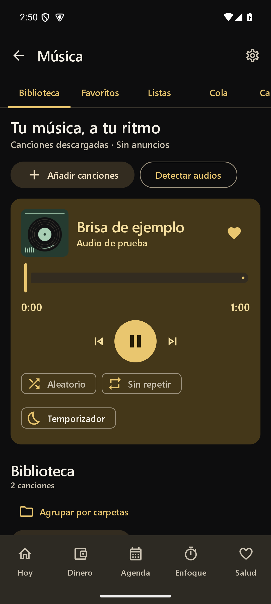
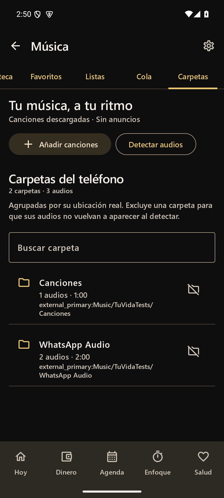
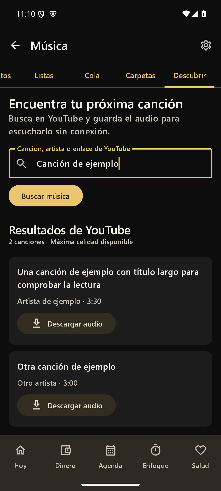

# Tu Vida · Android

Tu app personal para reunir dinero, agenda, estudio, salud y música. **Android nativo con Kotlin y Jetpack Compose**, diseñado para Redmi 13 y compatible con Android 8 o posterior. Interfaz en español, paleta negro y dorado con acentos salvia, cobre y ciruela, temas claro/oscuro y tipografía Semibold. Las instalaciones nuevas empiezan en oscuro; al actualizar se conserva el tema elegido. Para ver el fondo negro, selecciona **Ajustes → Tema → Oscuro**; el tema claro combina marfil, negro y dorado.

<p>  </p>
<p> </p>
<p></p>

Capturas reales del emulador Android; los datos mostrados son ejemplos de verificación.

## Instalar en tu Redmi

El APK local se genera en **`artifacts/Tu-Vida-Android.apk`**. Copia el archivo al teléfono, ábrelo y permite la instalación desde esa aplicación cuando Android lo solicite. Es un APK de depuración para uso personal.

Al abrir:

1. En **Dinero**, añade tus movimientos o importa la copia JSON de **Mi Plata Clara** desde Ajustes. La app comienza sin cifras personales inventadas.
2. En **Ajustes → Google Calendar**, autoriza el permiso y selecciona los calendarios que sincroniza tu cuenta Google en el teléfono. Si no aparecen, activa la sincronización de Calendario en Android y pulsa Actualizar. También puedes conectar la dirección secreta iCal de Google, de solo lectura.
3. Permite notificaciones y alarmas precisas desde Ajustes. En HyperOS/MIUI, revisa **Inicio automático**, **Notificaciones** y **Batería → Sin restricciones** para Tu Vida. El teléfono conserva el control final sobre la entrega de los avisos.
4. Mantén pulsada la pantalla principal → **Widgets → Tu Vida** para añadir Agenda, Finanzas, Salud y Enfoque.
5. Abre **Música** desde el icono de nota musical superior o **Hoy → Escuchar mi música**. Pulsa **Detectar audios** para autorizar y leer los audios del teléfono, o **Añadir canciones** para elegir varios archivos con el selector Android. El permiso de audios se solicita únicamente al pulsar Detectar; elegir archivos no necesita acceso general al almacenamiento.
6. En **Música → Carpetas**, o **Biblioteca → Agrupar por carpetas**, abre una carpeta para ver y reproducir sus audios. Usa el icono de carpeta excluida o **Excluir esta carpeta** para retirar un bloque, como audios de WhatsApp. La confirmación muestra la ruta y cantidad; los archivos permanecen en el teléfono. La exclusión se recuerda al detectar de nuevo. Desde **Carpetas excluidas** puedes volver a incluirla y pulsar Detectar audios.
7. En **Música → Buscar y descargar**, o en la pestaña **Descubrir**, escribe una canción, un artista o pega un enlace HTTPS de YouTube. Pulsa **Buscar música → Descargar audio**. Al terminar aparece en Biblioteca y en **Carpetas → Descargas**, lista para reproducir sin conexión. La primera descarga puede tardar más mientras se prepara el motor.

Para actualizar desde 1.0.0, instala el nuevo APK sobre la app existente, sin desinstalarla: conserva los datos locales cuando Android acepta la misma firma.

También se compila un APK en cada ejecución de [GitHub Actions](https://github.com/Alejandro6111/APP-Tu-vida-/actions), disponible en los artefactos del trabajo Android. La compilación pública usa la fuente alternativa de Android, salvo que se incorpore una fuente con licencia adecuada.

El flujo instala explícitamente `platform-tools`, API 35 y build-tools 35.0.0; no solicita el paquete obsoleto `tools` del SDK.

## Funciones

### Dinero

Portado de `Proyectos de apoyo/Mis finanzas y creditos`, con cálculos nativos:

- Ingresos, gastos, suscripciones y créditos; movimientos únicos, semanales, cada 15 días, mensuales, bimestrales, trimestrales, semestrales o anuales.
- Valor, categoría, fecha inicial/final, día de pago o último día hábil; festivos colombianos con Ley Emiliani y fechas de Pascua.
- Créditos con total de cuotas, cuota inicial y última cuota recalculada; avance, saldo pendiente, fecha final y simulación de abonos por deuda menor o cuota mayor. No calcula intereses.
- Saldo proyectado, dinero disponible, saldo registrado, arrastre mensual, comparación con el mes anterior y presupuesto diario/semanal según días de uso configurables.
- Diario de gastos que reduce el presupuesto y el saldo que pasa al mes siguiente.
- Ahorro protegido con frecuencia y mes de inicio, metas, abonos y aportes vinculables al plan mensual.
- Proyección de 12 meses, saldo total/libre, ahorro acumulado, calendario de pagos y gastos, categorías planeadas/registradas, diagnóstico 0–100 y avisos.
- Pagos y cobros marcables, búsqueda, filtros, duplicación, edición, eliminación con deshacer, importación JSON y CSV de 12 meses.

**Notas de cálculo:** el cierre proyectado resta todos los compromisos previstos; el saldo registrado usa únicamente pagos/cobros marcados y gastos diarios. El ahorro protegido no supera el saldo positivo y se acumula en la proyección, reduciéndose si el saldo deja de respaldarlo. El presupuesto de hoy resta lo ya anotado hoy de su reparto original; los ritmos son referencias, no límites bancarios. Una cuota inicial mayor que 1 representa cuotas anteriores ya pagadas; las siguientes requieren marcación. El simulador reutiliza las cuotas liberadas como abonos.

### Agenda y fútbol

- Calendarios del teléfono seleccionables mediante Android Calendar Provider. La cuenta se administra en Android; no se piden credenciales ni se escriben eventos en Google.
- Conexión opcional por dirección secreta iCal de Google, cifrada con Android Keystore. Reglas recurrentes, exclusiones y excepciones mediante Biweekly.
- FC Barcelona, Colombia y Millonarios con las **mismas fuentes de Aurora/Star.me personal**: `fc-barcelona.ics`, `co.ics` y `millonarios.ics` de `ics.fixtur.es/v2/`.
- Próximos eventos y partidos en hora del teléfono, filtros por equipo, búsqueda, actualización manual y caché con aviso cuando falla la conexión.
- Sincronización automática cada seis horas con WorkManager; Android puede diferirla. Horizonte de 60 días; actualizar manualmente trae cambios más recientes. Las fuentes son independientes: un fallo no borra los últimos datos de las otras.
- Tareas y sesiones con fecha, hora, duración, repetición diaria/semanal y completado. Completar una tarea recurrente la mueve a su siguiente ocurrencia.
- Avisos de preparación para títulos de calendario que coincidan con palabras configurables; cualquier evento personal permite crear una sesión de estudio.

Los feeds públicos pueden cambiar horarios o no tener encuentros futuros. Tu Vida no inventa partidos ni los añade a Google. iCal es de solo lectura; excepciones avanzadas `RANGE=THISANDFUTURE` y duraciones RDATE de tipo PERIOD no tienen soporte completo en Biweekly.

### Enfoque

- Pomodoro configurable: enfoque, pausa, pausa larga y ciclos. Al terminar una etapa, espera a que empieces la siguiente.
- Cronómetro con pausa, continuación, reinicio y vueltas.
- Estado guardado y cálculo por marca de tiempo al volver a abrir; aviso final por AlarmManager y registro de minutos de estudio.

### Salud

- Registro diario de desayuno, almuerzo, cena, entre comidas, notas, ejercicio, actividad y minutos.
- Calendario propio: **verde** al registrar ejercicio, **rojo** al registrar un día sin ejercicio, **neutro** cuando todavía no se ha registrado. Cada estado también tiene texto accesible.
- Edición de días anteriores, días de ejercicio y minutos del mes. No permite registrar actividad en días futuros.

### Música y buscador propio, sin anuncios

- Biblioteca de audios del teléfono y selección de varios archivos con acceso persistente de Android. Se leen título, artista, álbum y duración; búsqueda que ignora acentos y orden por título, artista, duración o adición reciente.
- Agrupación por carpetas reales, diferenciando ruta completa y volumen de almacenamiento; búsqueda de carpetas, contador de audios/duración y reproducción del contenido de cada una. Excluir una carpeta limpia sus referencias en biblioteca, favoritos, listas y cola, sin borrar archivos, y la omite en futuras detecciones/importaciones. Volver a incluirla permite cargarla de nuevo con Detectar audios.
- Portadas locales: muestra la imagen incrustada cuando existe; si falta, genera un vinilo geométrico estable por canción con variaciones dorado/cobre/salvia/ciruela. Aparecen en biblioteca, favoritos, listas, cola, reproductor y minirreproductor; los controles multimedia Android reciben la portada generada. Lectura en segundo plano, concurrencia limitada y caché de imágenes; sin búsquedas ni descargas de imágenes.
- Favoritos y listas persistentes: crear, renombrar, eliminar, añadir/quitar canciones y cambiar su orden. Eliminar una lista o quitar una canción de la biblioteca **no borra archivos del teléfono**.
- Reproducir una canción o todo el conjunto visible, pausa/continuación, anterior/siguiente y deslizador para avanzar dentro del audio.
- Repetición desactivada, de una canción o de toda la cola; modo aleatorio independiente. Cola con reproducción directa, añadir al final o después de la actual, quitar y mover canciones. Si una referencia de audio ya está en la cola, la app te avisa.
- Reproducción en segundo plano mediante Media3 y servicio Android `mediaPlayback`, con controles de sistema, notificación multimedia y sesión para pantalla bloqueada/controles de audífonos. Minirreproductor en los otros apartados de Tu Vida.
- Gestión del foco de audio de Android y pausa al desconectar audífonos. Temporizador para pausar en 5, 15, 30, 60 o 90 minutos, cancelable; funciona en el servicio aunque salgas de la pantalla.
- Cola, canción, posición aproximada, repetición y aleatorio guardados localmente. Al volver a abrir después de cerrar el proceso, la reproducción queda pausada hasta que pulses reproducir. La posición se guarda al cambiar de estado y cada diez segundos durante la reproducción.
- Buscador integrado de YouTube: hasta 20 resultados por canción/artista, con título, canal/artista y duración cuando el proveedor la informa. También acepta un enlace individual de YouTube, YouTube Music o youtu.be; los enlaces con una lista descargan solo el video seleccionado. Las emisiones en directo se omiten.
- Descarga el mejor audio disponible para la app con [yt-dlp integrado mediante youtubedl-android 0.18.1](https://github.com/yausername/youtubedl-android) y FFmpeg. Conserva el códec original (por ejemplo, AAC en M4A u Opus) al extraer el audio, evitando la pérdida adicional de convertirlo a MP3; no impone un bitrate reducido ni mejora la calidad de origen. Usa `bestaudio/best` y `--audio-format best`, según la [documentación de yt-dlp](https://github.com/yt-dlp/yt-dlp#post-processing-options). Python y QuickJS incluidos en el APK. No necesita Termux, cuenta de Google, claves API ni servidor personal. El APK aumenta de tamaño al incluir estos motores; el instalador personal incluye solo ARM64 para reducirlo.
- Una descarga a la vez mediante WorkManager, con estado/progreso en la app, notificación de Android y cancelación desde ambos lugares. Continúa al cambiar de apartado o enviar la app al fondo; Android decide cuándo ejecutar trabajos pendientes y puede detenerlos. Sin conexión espera hasta recuperarla; los fallos del proveedor se muestran para que vuelvas a intentar. El límite del archivo de origen es 500 MiB. Solo los audios terminados se incorporan a la biblioteca; se reutiliza un archivo ya descargado para evitar duplicados.
- **Actualizar motor** obtiene la versión estable de yt-dlp desde GitHub. Úsalo si YouTube cambia y deja de funcionar una búsqueda o descarga. La app muestra problemas de conexión/acceso sin exponer la salida interna del motor. El permiso de notificaciones se pide al pulsar Descargar en Android 13+; si lo rechazas puedes seguir usando el progreso y la cancelación dentro de la app.

Reproducir y leer la biblioteca sigue siendo local, sin anuncios. Buscar/descargar usa Internet y transmite la búsqueda o el enlace seleccionado a YouTube; actualizar el motor consulta GitHub. El proveedor puede restringir contenido, región o acceso; no se descargan contenidos privados, de pago ni protegidos mediante DRM. Los formatos locales disponibles dependen de Media3 y los decodificadores Android (por ejemplo, MP3, AAC/M4A, Ogg, FLAC y WAV compatibles). No incluye ecualizador ni letras.

Las descargas se guardan en `filesDir/music/`, dentro del espacio privado de Tu Vida, y se leen con un FileProvider limitado a esa carpeta. No requiere permisos de almacenamiento ni acceso general a archivos. **Desinstalar la app o borrar sus datos elimina también estos audios.** No se copian a la carpeta pública de Descargas del teléfono. Quitar una canción de la biblioteca o excluir Descargas conserva el archivo; Detectar audios puede reincorporarlo al volver a incluir esa carpeta. Si Descargas está excluida, hay que incluirla antes de descargar otra canción. La copia JSON guarda referencias, no estos archivos de audio.

Si restauras una copia en otro teléfono y falta un audio descargado, busca la misma canción y pulsa **Recuperar descarga**; vuelve a descargar el mejor audio disponible y actualiza las referencias de favoritos, listas y cola si cambia la extensión. Si el archivo ya existe, se reutiliza. Los MP3 descargados con versiones anteriores siguen funcionando y no se vuelven a descargar automáticamente; esta mejora se aplica al obtener archivos nuevos.

La copia JSON conserva la biblioteca, favoritos, listas y cola como referencias: **no incluye los audios ni transfiere permisos Android**. En otro teléfono, o si moviste/eliminaste archivos, vuelve a elegirlos o a detectar audios; las referencias antiguas pueden requerir quitarse y añadirse de nuevo a las listas. Las copias anteriores a Música siguen siendo compatibles y restauran una biblioteca vacía. El temporizador para dormir no se recupera tras matar el proceso o reiniciar el teléfono; no se inicia música automáticamente. Las restricciones de batería de HyperOS también pueden detener un servicio multimedia y necesitan probarse en el Redmi.

### Recordatorios y widgets

- Canales independientes para tareas/agenda, partidos, estudio, ejercicio y pagos.
- Intensidad normal o intensa; anticipación, horarios de silencio, palabras de estudio y hora de ejercicio configurables.
- Intensidad alta: avisos anticipados, a diez minutos y al inicio; tres avisos posteriores cada quince minutos para tareas pendientes. Ejercicio avisa a la hora elegida, 30 y 60 minutos después, y deja de insistir al registrar actividad.
- Completar tareas y posponer diez minutos desde una notificación.
- Alarmas recuperadas tras reiniciar, actualizar la app, cambiar hora/zona o conceder alarmas precisas. Sin ese permiso se usan alarmas aproximadas; sin permiso de notificaciones no se muestra el aviso. Silencio excluye avisos en esa franja; los temporizadores iniciados por ti quedan exceptuados.
- Cuatro widgets redimensionables: agenda, dinero, salud y enfoque. Abren directamente su apartado y se actualizan tras cambios o periódicamente. El widget de enfoque muestra una instantánea; el contador continuo está dentro de la app.

## Datos y copias

Los datos financieros, de salud y tareas permanecen en almacenamiento privado del teléfono (`AtomicFile`, JSON validado). No hay backend propio, publicidad ni analítica. Las consultas de red son los calendarios activados y, cuando lo solicitas, la búsqueda/descarga de música y actualización de su motor; estas acciones no transmiten los datos de finanzas o salud. La copia JSON es un archivo sin cifrar elegido por el usuario; guárdala en un lugar privado. Exportar no incluye la URL secreta iCal, los eventos sincronizados ni los IDs de calendario del teléfono. Al restaurar, vuelve a seleccionar tus calendarios.

Importar valida la copia completa y muestra una confirmación antes de reemplazar datos. Acepta el formato de Tu Vida v1 y las copias de Mi Plata Clara v8. Desinstalar o borrar los datos de Android elimina la información local; exporta antes. Las copias automáticas del sistema están excluidas para evitar transferir claves o datos privados sin la copia explícita.

## Compilar

Requisitos: **JDK 17**, Android SDK **API 35**, build-tools 34.0.0 e Internet para descargar las dependencias. Gradle Wrapper 8.9 incluido.

```powershell
./build-android.ps1 -JavaHome 'C:\ruta\jdk-17' -SdkRoot 'C:\ruta\android-sdk'
```

El script genera por defecto **ARM64 (`arm64-v8a`)** para el Redmi. Para otro teléfono usa `-Abi armeabi-v7a`; para el emulador habitual, `-Abi x86_64`; `-Abi universal` incluye las cuatro arquitecturas y ocupa más. Al ejecutar Gradle directamente se incluyen todas, salvo que indiques `-PtuVidaAbi=arm64-v8a` (u otra arquitectura compatible).

En Android Studio abre la carpeta `android`. En Linux/macOS:

```sh
cd android
bash gradlew assembleDebug testDebugUnitTest lintDebug
```

**Segoe UI Semibold:** el APK personal local puede incluir el archivo autorizado como `android/app/src/main/res/font/segoe_semibold.ttf`, o usando `-SegoeFont 'ruta-del-archivo.ttf'`. El archivo queda fuera de Git; no se redistribuyen fuentes propietarias en el repositorio. Si falta, se usa Sans Serif Semibold. Para distribuir públicamente un APK con Segoe necesitas derechos de incrustación/distribución adecuados; el archivo de Windows no otorga por sí solo una licencia de distribución Android.

## Verificar

```sh
cd android
bash gradlew testDebugUnitTest lintDebug
bash gradlew connectedDebugAndroidTest
```

Las pruebas cubren saldo arrastrado, pagos reales, gastos diarios, frecuencias, cuotas, festivos, ahorro, proyección, presupuesto, deudas, categorías, copias, recurrencias iCal, excepciones, horarios de silencio, repetición de tareas, transición de pomodoro y biblioteca/listas de música. Las pruebas en Android reproducen archivos WAV reales de ejemplo, comprueban lectura local, favoritos/listas, segundo plano, guardado de cola/modos/posición y temporizador, y capturan el control multimedia de sistema. Los reportes se generan en `android/app/build/reports/`.

La actualización 1.3.1 pasó **85 pruebas JVM y las 4 pruebas de Descubrir en Android 15**, incluida una descarga real de YouTube en segundo plano. Una prueba local ofrece dos calidades de AAC y Opus, comprueba que el motor elige la superior y compara hashes SHA-256 de los paquetes de audio antes/después de la extracción: son idénticos. También verifica lectura, reproducción y recuperación de favoritos/listas/cola desde una referencia MP3 anterior. Compilación y lint sin errores (13 avisos no bloqueantes); capturas inspeccionadas en claro, oscuro y letra 1.3. APK personal 1.3.1 ARM64 disponible en `artifacts/Tu-Vida-Android.apk`.

La actualización 1.3.0 pasó **82 pruebas JVM y 15 pruebas en Android 15**, con la prueba externa de YouTube activada, además de compilación y lint sin errores (13 avisos no bloqueantes en el informe final, incluido el de ABI para ChromeOS). Se verifica el motor nativo, conversión local a MP3, lectura privada, incorporación sin duplicados y una búsqueda/descarga real de un audio de prueba con la app enviada al fondo. Se conservan las comprobaciones de finanzas, agenda, avisos, biblioteca, carpetas, copias y portadas. Las capturas de Descubrir se inspeccionan en claro, oscuro y letra 1.3. Los detalles y límites se registran en [docs/VERIFICATION.md](docs/VERIFICATION.md). La cuenta Google, los audífonos físicos y HyperOS necesitan comprobarse en tu Redmi.

La prueba externa se activa explícitamente y depende del proveedor; las verificaciones habituales la omiten para no exigir YouTube en cada compilación:

```sh
cd android
./gradlew connectedDebugAndroidTest -Pandroid.testInstrumentationRunnerArguments.onlineMusicSmoke=true
```

## Estructura y cambios

Consulta [AGENTS.md](AGENTS.md) para el mapa detallado y las reglas de trabajo; también se incluye `agents.ms`, como solicitaste. Las referencias originales se conservan en `Proyectos de apoyo/`. El desarrollo principal está en `android/app/src/main/java/co/tuvida/app/`, separado en `data`, `domain`, `platform` y `ui`.

**1.3.1:** conserva la calidad original del mejor audio disponible al descargar, sin conversión obligatoria a MP3. Biblioteca y buscador reconocen M4A, Opus y los demás formatos de audio admitidos. Recuperar una descarga actualiza sus referencias sin perder favoritos, listas, cola ni posición; conserva compatibilidad con los MP3 anteriores.

**1.3.0:** buscador de YouTube, enlaces individuales, descarga de audio MP3 dentro de la app, progreso/cancelación, actualización manual del motor y entrada automática a la biblioteca. Mantiene el formato de datos y las copias anteriores. El instalador personal se compila para ARM64; Gradle conserva la variante universal para otros dispositivos y verificaciones. Consulta las atribuciones de las dependencias nativas en [THIRD_PARTY.md](THIRD_PARTY.md).

**1.2.0:** negro y dorado en la app, icono y widgets; carpetas reales con exclusión persistente y restauración; portadas locales para canciones descargadas. Las copias anteriores a 1.2.0 se cargan con carpetas desconocidas y sin exclusiones; Detectar audios actualiza su ubicación. Las nuevas copias conservan rutas y exclusiones. Si un proveedor de documentos no informa la ruta, el audio aparece en «Carpeta no disponible» y puede quitarse individualmente.

**1.1.0:** reproductor de música local sin anuncios, biblioteca, favoritos, listas, cola, repetición, aleatorio, controles de sistema y temporizador para dormir. Conserva la pantalla al cambiar el tamaño de letra o recrear la Activity.

**1.0.0:** primera app nativa con finanzas, agenda, calendarios de fútbol, tareas, enfoque, salud, avisos, widgets, respaldos y compilación automatizada.
