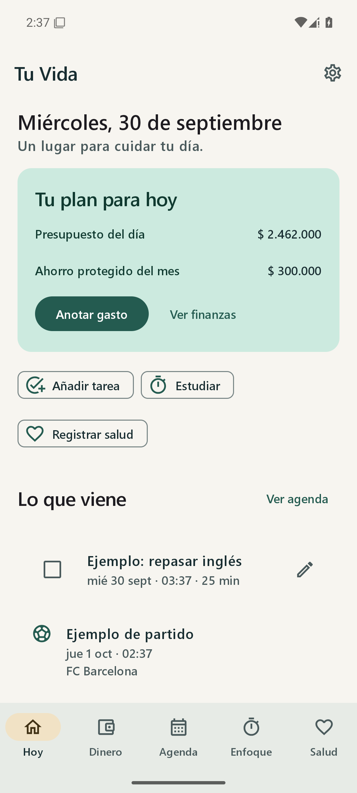
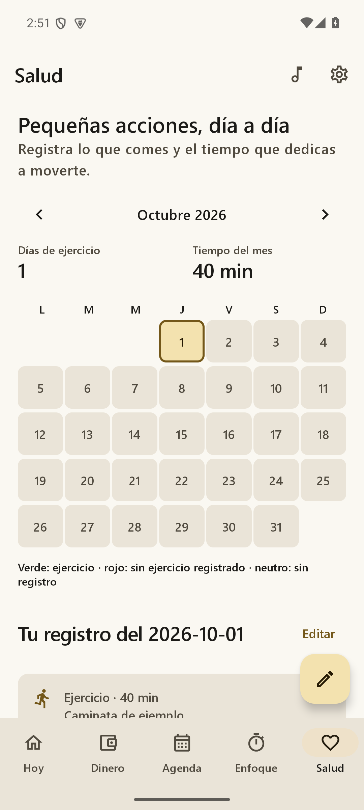
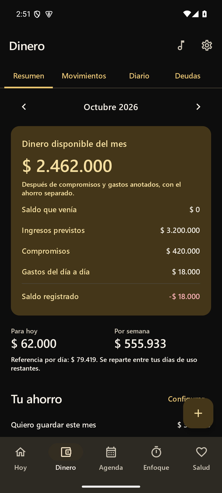

# Tu Vida · Android

Tu app personal para reunir dinero, agenda, estudio y salud. **Android nativo con Kotlin y Jetpack Compose**, diseñado para Redmi 13 y compatible con Android 8 o posterior. Interfaz en español, paleta verde petróleo, marfil y dorado, temas claro/oscuro y tipografía Semibold.

<p>  </p>

Capturas reales del emulador Android; los datos mostrados son ejemplos de verificación.

## Instalar en tu Redmi

El APK local se genera en **`artifacts/Tu-Vida-Android.apk`**. Copia el archivo al teléfono, ábrelo y permite la instalación desde esa aplicación cuando Android lo solicite. Es un APK de depuración para uso personal.

Al abrir:

1. En **Dinero**, añade tus movimientos o importa la copia JSON de **Mi Plata Clara** desde Ajustes. La app comienza sin cifras personales inventadas.
2. En **Ajustes → Google Calendar**, autoriza el permiso y selecciona los calendarios que sincroniza tu cuenta Google en el teléfono. Si no aparecen, activa la sincronización de Calendario en Android y pulsa Actualizar. También puedes conectar la dirección secreta iCal de Google, de solo lectura.
3. Permite notificaciones y alarmas precisas desde Ajustes. En HyperOS/MIUI, revisa **Inicio automático**, **Notificaciones** y **Batería → Sin restricciones** para Tu Vida. El teléfono conserva el control final sobre la entrega de los avisos.
4. Mantén pulsada la pantalla principal → **Widgets → Tu Vida** para añadir Agenda, Finanzas, Salud y Enfoque.

También se compila un APK en cada ejecución de [GitHub Actions](https://github.com/Alejandro6111/APP-Tu-vida-/actions), disponible en los artefactos del trabajo Android. La compilación pública usa la fuente alternativa de Android, salvo que se incorpore una fuente con licencia adecuada.

El flujo instala explícitamente `platform-tools`, API 35 y build-tools 35.0.0; no solicita el paquete obsoleto `tools` del SDK.

## Funciones

### Dinero

Portado de `Proyectos de apoyo/Mis finanzas y creditos`, con cálculos nativos:

- Ingresos, gastos, suscripciones y créditos; movimientos únicos, semanales, cada 15 días, mensuales, bimestrales, trimestrales, semestrales o anuales.
- Valor, categoría, fecha inicial/final, día de pago o último día hábil; festivos colombianos con Ley Emiliani y fechas de Pascua.
- Créditos con total de cuotas, cuota inicial y última cuota recalculada; avance, saldo pendiente, fecha final y simulación de abonos por deuda menor o cuota mayor. No calcula intereses.
- Saldo proyectado, dinero disponible, saldo registrado, arrastre mensual, comparación con el mes anterior y presupuesto diario/semanal según días de uso configurables.
- Diario de gastos que reduce el presupuesto y el saldo que pasa al mes siguiente.
- Ahorro protegido con frecuencia y mes de inicio, metas, abonos y aportes vinculables al plan mensual.
- Proyección de 12 meses, saldo total/libre, ahorro acumulado, calendario de pagos y gastos, categorías planeadas/registradas, diagnóstico 0–100 y avisos.
- Pagos y cobros marcables, búsqueda, filtros, duplicación, edición, eliminación con deshacer, importación JSON y CSV de 12 meses.

**Notas de cálculo:** el cierre proyectado resta todos los compromisos previstos; el saldo registrado usa únicamente pagos/cobros marcados y gastos diarios. El ahorro protegido no supera el saldo positivo y se acumula en la proyección, reduciéndose si el saldo deja de respaldarlo. El presupuesto de hoy resta lo ya anotado hoy de su reparto original; los ritmos son referencias, no límites bancarios. Una cuota inicial mayor que 1 representa cuotas anteriores ya pagadas; las siguientes requieren marcación. El simulador reutiliza las cuotas liberadas como abonos.

### Agenda y fútbol

- Calendarios del teléfono seleccionables mediante Android Calendar Provider. La cuenta se administra en Android; no se piden credenciales ni se escriben eventos en Google.
- Conexión opcional por dirección secreta iCal de Google, cifrada con Android Keystore. Reglas recurrentes, exclusiones y excepciones mediante Biweekly.
- FC Barcelona, Colombia y Millonarios con las **mismas fuentes de Aurora/Star.me personal**: `fc-barcelona.ics`, `co.ics` y `millonarios.ics` de `ics.fixtur.es/v2/`.
- Próximos eventos y partidos en hora del teléfono, filtros por equipo, búsqueda, actualización manual y caché con aviso cuando falla la conexión.
- Sincronización automática cada seis horas con WorkManager; Android puede diferirla. Horizonte de 60 días; actualizar manualmente trae cambios más recientes. Las fuentes son independientes: un fallo no borra los últimos datos de las otras.
- Tareas y sesiones con fecha, hora, duración, repetición diaria/semanal y completado. Completar una tarea recurrente la mueve a su siguiente ocurrencia.
- Avisos de preparación para títulos de calendario que coincidan con palabras configurables; cualquier evento personal permite crear una sesión de estudio.

Los feeds públicos pueden cambiar horarios o no tener encuentros futuros. Tu Vida no inventa partidos ni los añade a Google. iCal es de solo lectura; excepciones avanzadas `RANGE=THISANDFUTURE` y duraciones RDATE de tipo PERIOD no tienen soporte completo en Biweekly.

### Enfoque

- Pomodoro configurable: enfoque, pausa, pausa larga y ciclos. Al terminar una etapa, espera a que empieces la siguiente.
- Cronómetro con pausa, continuación, reinicio y vueltas.
- Estado guardado y cálculo por marca de tiempo al volver a abrir; aviso final por AlarmManager y registro de minutos de estudio.

### Salud

- Registro diario de desayuno, almuerzo, cena, entre comidas, notas, ejercicio, actividad y minutos.
- Calendario propio: **verde** al registrar ejercicio, **rojo** al registrar un día sin ejercicio, **neutro** cuando todavía no se ha registrado. Cada estado también tiene texto accesible.
- Edición de días anteriores, días de ejercicio y minutos del mes. No permite registrar actividad en días futuros.

### Recordatorios y widgets

- Canales independientes para tareas/agenda, partidos, estudio, ejercicio y pagos.
- Intensidad normal o intensa; anticipación, horarios de silencio, palabras de estudio y hora de ejercicio configurables.
- Intensidad alta: avisos anticipados, a diez minutos y al inicio; tres avisos posteriores cada quince minutos para tareas pendientes. Ejercicio avisa a la hora elegida, 30 y 60 minutos después, y deja de insistir al registrar actividad.
- Completar tareas y posponer diez minutos desde una notificación.
- Alarmas recuperadas tras reiniciar, actualizar la app, cambiar hora/zona o conceder alarmas precisas. Sin ese permiso se usan alarmas aproximadas; sin permiso de notificaciones no se muestra el aviso. Silencio excluye avisos en esa franja; los temporizadores iniciados por ti quedan exceptuados.
- Cuatro widgets redimensionables: agenda, dinero, salud y enfoque. Abren directamente su apartado y se actualizan tras cambios o periódicamente. El widget de enfoque muestra una instantánea; el contador continuo está dentro de la app.

## Datos y copias

Los datos financieros, de salud y tareas permanecen en almacenamiento privado del teléfono (`AtomicFile`, JSON validado). No hay backend, publicidad ni analítica. Las únicas consultas de red son los calendarios activados. La copia JSON es un archivo sin cifrar elegido por el usuario; guárdala en un lugar privado. Exportar no incluye la URL secreta iCal, los eventos sincronizados ni los IDs de calendario del teléfono. Al restaurar, vuelve a seleccionar tus calendarios.

Importar valida la copia completa y muestra una confirmación antes de reemplazar datos. Acepta el formato de Tu Vida v1 y las copias de Mi Plata Clara v8. Desinstalar o borrar los datos de Android elimina la información local; exporta antes. Las copias automáticas del sistema están excluidas para evitar transferir claves o datos privados sin la copia explícita.

## Compilar

Requisitos: **JDK 17**, Android SDK **API 35**, build-tools 35.0.0 e Internet para descargar las dependencias. Gradle Wrapper 8.9 incluido.

```powershell
./build-android.ps1 -JavaHome 'C:\ruta\jdk-17' -SdkRoot 'C:\ruta\android-sdk'
```

En Android Studio abre la carpeta `android`. En Linux/macOS:

```sh
cd android
bash gradlew assembleDebug testDebugUnitTest lintDebug
```

**Segoe UI Semibold:** el APK personal local puede incluir el archivo autorizado como `android/app/src/main/res/font/segoe_semibold.ttf`, o usando `-SegoeFont 'ruta-del-archivo.ttf'`. El archivo queda fuera de Git; no se redistribuyen fuentes propietarias en el repositorio. Si falta, se usa Sans Serif Semibold. Para distribuir públicamente un APK con Segoe necesitas derechos de incrustación/distribución adecuados; el archivo de Windows no otorga por sí solo una licencia de distribución Android.

## Verificar

```sh
cd android
bash gradlew testDebugUnitTest lintDebug
bash gradlew connectedDebugAndroidTest
```

Las pruebas cubren saldo arrastrado, pagos reales, gastos diarios, frecuencias, cuotas, festivos, ahorro, proyección, presupuesto, deudas, categorías, copias, recurrencias iCal, excepciones, horarios de silencio, repetición de tareas y transición de pomodoro. Los reportes se generan en `android/app/build/reports/`.

La entrega pasó **58 pruebas de dominio y 8 pruebas en Android 15**, además de compilación y lint sin errores. Las comprobaciones de interfaz en emulador y el alcance final se registran en [docs/VERIFICATION.md](docs/VERIFICATION.md). El permiso real de la cuenta Google y las restricciones de HyperOS necesitan comprobarse en tu Redmi.

## Estructura y cambios

Consulta [AGENTS.md](AGENTS.md) para el mapa detallado y las reglas de trabajo; también se incluye `agents.ms`, como solicitaste. Las referencias originales se conservan en `Proyectos de apoyo/`. El desarrollo principal está en `android/app/src/main/java/co/tuvida/app/`, separado en `data`, `domain`, `platform` y `ui`.

**1.0.0:** primera app nativa con finanzas, agenda, calendarios de fútbol, tareas, enfoque, salud, avisos, widgets, respaldos y compilación automatizada.
